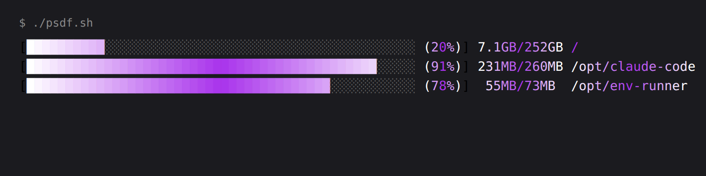
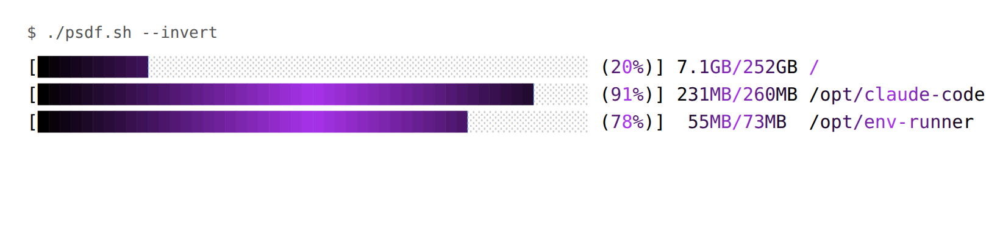

# psdf
pascal simple df script
---
A simple script to show `df -h` output on Linux (and BSD/macOS) as progress bars.

For every real filesystem it prints a usage bar, the used percentage, the
used/total space, and the mount point:



## Features

- **Gradient bars and labels** that shade from white to purple and back, using
  24-bit truecolor when the terminal supports it and falling back to the
  xterm-256 palette otherwise.
- **Used / total space** shown next to the percentage (e.g. `231MB/260MB`), with
  the separator and the mount points aligned into columns.
- **Only real storage**: virtual/temporary filesystems (tmpfs, proc, snap
  squashfs, ...) are filtered out and each mount point is shown once. On Linux
  `lsblk` is used to restrict to real block devices when available.
- **Fast**: parsing is done in pure bash with no per-line subprocesses.

## Usage

```
./psdf.sh            # gradient for a dark terminal background
./psdf.sh --invert   # shade from black instead of white, for bright backgrounds
./psdf.sh --help     # show options
```

The invert mode can also be enabled with `PSDF_INVERT=1`. Colour depth is
auto-detected; force it with `PSDF_COLORS=truecolor` or `PSDF_COLORS=256`.

### Invert mode (bright backgrounds)


